# SyntaxKit

**Generate Swift code programmatically with declarative syntax.** SyntaxKit is a Swift package that provides a type-safe, result builder-based API for generating Swift code structures. It's designed for macro development, model transformers, and migration utilities—scenarios where you need to programmatically create Swift code rather than writing it by hand. If you're writing code you could write by hand once, stick with regular Swift. If you're generating repetitive code structures, transforming data models, or building developer tools that output Swift code, SyntaxKit provides a declarative way to do it.

Unlike manually writing SwiftSyntax AST nodes, SyntaxKit uses result builders to make code generation readable and maintainable. Perfect for macro authors who need to generate complex Swift structures, or developers building tools that automatically create boilerplate code from external schemas, APIs, or configurations.

**When to choose SyntaxKit:** You're building a Swift macro, creating model layers from databases, transforming data schemas into Swift types, or building developer tools that output Swift code. **When to choose regular Swift:** You're writing application logic, view controllers, or any code you'd normally type by hand.

SyntaxKit transforms this complex task into declarative, readable code generation—making macro development and code generation tools significantly more approachable for Swift developers.

## When to Use SyntaxKit

```mermaid
graph TD
    A[Need to generate Swift code?] --> B{Code generation frequency?}
    B -->|One-time/Static| C[Write Swift manually]
    B -->|Repetitive/Dynamic| D{What type of generation?}
    
    D -->|Swift Macros| E[✅ Perfect for SyntaxKit]
    D -->|Data Model Generation| F[✅ Ideal SyntaxKit use case]
    D -->|Model/Entity Generation| G[✅ Great SyntaxKit fit]
    D -->|Developer Tools| H[✅ SyntaxKit recommended]
    D -->|App Logic/UI| I[❌ Use regular Swift]
    
    style E fill:#22c55e,stroke:#16a34a,color:#ffffff
    style F fill:#22c55e,stroke:#16a34a,color:#ffffff
    style G fill:#22c55e,stroke:#16a34a,color:#ffffff
    style H fill:#22c55e,stroke:#16a34a,color:#ffffff
    style I fill:#ef4444,stroke:#dc2626,color:#ffffff
    style C fill:#6b7280,stroke:#4b5563,color:#ffffff
```



**✅ Choose SyntaxKit when:**
- Building Swift macros or compiler plugins
- Generating Swift code from external schemas (GraphQL, databases, JSON schemas)
- Creating developer tools that output Swift code
- Building code generators or transformers
- Need type-safe programmatic Swift code construction

**❌ Use regular Swift when:**
- Writing application business logic
- Creating UI components or view controllers  
- Building standard iOS/macOS app features
- Code you'd write once and maintain manually

> 🎓 **New to SyntaxKit?** Start with our [**Complete Getting Started Guide**](https://swiftpackageindex.com/brightdigit/SyntaxKit/documentation) - from zero to building your first macro in 10 minutes.

## Why SyntaxKit Excels

### API Client Generation
**Manual Approach (hundreds of lines per endpoint):**
```swift
// Manually writing each endpoint...
struct UsersAPI {
    func getUser(id: Int) async throws -> User {
        let url = URL(string: "\(baseURL)/users/\(id)")!
        // ... boilerplate networking code
    }
    
    func createUser(_ user: CreateUserRequest) async throws -> User {
        let url = URL(string: "\(baseURL)/users")!
        // ... more boilerplate
    }
    // Repeat for every endpoint...
}
```

**SyntaxKit Approach (generate from OpenAPI spec):**
```swift
// Generate entire API client from schema
let apiClient = generateAPIClient(from: openAPISpec) {
    for endpoint in spec.endpoints {
        Function(endpoint.name) {
            Parameter("request", type: endpoint.requestType)
        }
        .async()
        .throws()
        .returns(endpoint.responseType)
        .body {
            // Generated networking implementation
        }
    }
}
```

### Model Generation with Computed Properties
**Manual Approach:**
```swift
// Repetitive model definitions...
struct User {
    let id: Int
    let firstName: String
    let lastName: String
    
    var fullName: String { "\(firstName) \(lastName)" }
    var initials: String { "\(firstName.prefix(1))\(lastName.prefix(1))" }
    var displayName: String { fullName.isEmpty ? "Anonymous" : fullName }
}

struct Product {
    let id: Int
    let name: String
    let price: Double
    
    var displayPrice: String { "$\(String(format: "%.2f", price))" }
    var isExpensive: Bool { price > 100.0 }
    // Similar pattern repeated...
}
```

**SyntaxKit Approach:**
```swift
// Generate models with computed properties from schema
for model in schema.models {
    Struct(model.name) {
        for field in model.fields {
            Property(field.name, type: field.type)
        }
        
        for computation in model.computedProperties {
            ComputedProperty(computation.name, type: computation.returnType) {
                computation.generateBody()
            }
        }
    }
}
```

### Migration Utility
**Manual Approach:**
```swift
// Hand-coding each transformation...
func migrateUserV1ToV2(_ v1User: UserV1) -> UserV2 {
    return UserV2(
        id: v1User.identifier,
        profile: ProfileV2(
            firstName: v1User.fname,
            lastName: v1User.lname,
            email: v1User.emailAddress
        ),
        settings: SettingsV2(
            theme: v1User.isDarkMode ? .dark : .light,
            notifications: v1User.allowNotifications
        )
    )
}
// Repeat for every migration...
```

**SyntaxKit Approach:**
```swift
// Generate migrations from mapping configuration
let migrations = generateMigrations(from: migrationConfig) {
    for migration in config.migrations {
        Function("migrate\(migration.from)To\(migration.to)") {
            Parameter("input", type: migration.fromType)
        }
        .returns(migration.toType)
        .body {
            Return {
                StructInit(migration.toType) {
                    for mapping in migration.fieldMappings {
                        FieldAssignment(mapping.target, value: mapping.transform)
                    }
                }
            }
        }
    }
}
```

**Result:** 95% less boilerplate, type-safe transformations, and maintainable code generation that scales with your schema changes.

## Quick Start (5 minutes)

### 1. Add SyntaxKit to Your Package (1 minute)
```swift
// Package.swift
dependencies: [
    .package(url: "https://github.com/brightdigit/SyntaxKit.git", from: "0.0.1")
]
```

### 2. Create Your First Code Generator (2 minutes)
```swift
import SyntaxKit

// Generate a data model with Equatable conformance
let userModel = Struct("User") {
    Property("id", type: "UUID")
    Property("name", type: "String") 
    Property("email", type: "String")
}
.conformsTo("Equatable")

print(userModel.generateCode())
```

### 3. See the Generated Result (instant)
```swift
struct User: Equatable {
    let id: UUID
    let name: String
    let email: String
}
```

### 4. Build a Simple Macro (2 minutes)
```swift
import SyntaxKit
import SwiftSyntaxMacros

@main
struct EquatableMacro: ExpressionMacro {
    static func expansion(
        of node: some FreestandingMacroExpansionSyntax,
        in context: some MacroExpansionContext
    ) throws -> ExprSyntax {
        // Use SyntaxKit to generate Equatable implementation
        let equatableImpl = Function("==") {
            Parameter("lhs", type: "Self")
            Parameter("rhs", type: "Self") 
        }
        .static()
        .returns("Bool")
        .body {
            // Generated comparison logic
        }
        
        return equatableImpl.expressionSyntax
    }
}
```

**✅ Done!** You've built type-safe Swift code generation. Ready for complex scenarios like API client generation or model transformers.

**Next Steps:** 
- 📖 **[Complete Macro Development Tutorial](https://swiftpackageindex.com/brightdigit/SyntaxKit/documentation)** - Step-by-step guide to building production macros
- 🚀 **[API Client Generation Examples](https://swiftpackageindex.com/brightdigit/SyntaxKit/documentation)** - Real-world code generation patterns
- 🔧 **[Integration Best Practices](https://swiftpackageindex.com/brightdigit/SyntaxKit/documentation)** - How to integrate SyntaxKit into your workflow

[](https://swiftpackageindex.com/brightdigit/SyntaxKit/documentation)
[](https://swift.org)


[](https://swiftpackageindex.com/brightdigit/SyntaxKit)
[](https://swiftpackageindex.com/brightdigit/SyntaxKit)

[](https://codecov.io/gh/brightdigit/SyntaxKit)
[](https://www.codefactor.io/repository/github/brightdigit/SyntaxKit)
[](https://codebeat.co/projects/github-com-brightdigit-SyntaxKit-main)
[](https://qlty.sh/gh/brightdigit/projects/SyntaxKit)

SyntaxKit provides a declarative way to generate Swift code structures using SwiftSyntax.

## Installation

Add SyntaxKit to your project using Swift Package Manager:

```swift
dependencies: [
    .package(url: "https://github.com/brightdigit/SyntaxKit.git", from: "0.0.1")
]
```

## Examples

SyntaxKit provides a set of result builders that allow you to create Swift code structures in a declarative way. Here's an example:

```swift
import SyntaxKit

let code = Struct("BlackjackCard") {
    Enum("Suit") {
        Case("spades").equals("♠")
        Case("hearts").equals("♡")
        Case("diamonds").equals("♢")
        Case("clubs").equals("♣")
    }
    .inherits("Character")
    .comment{
      Line("nested Suit enumeration")
    }
}

let generatedCode = code.generateCode()
```

This will generate the following Swift code:

```swift
struct BlackjackCard {
    // nested Suit enumeration
    enum Suit: Character {
        case spades = "♠"
        case hearts = "♡"
        case diamonds = "♢"
        case clubs = "♣"
    }
}
```

## Features

- Create structs, enums, and cases using result builders
- Add inheritance and comments to your code structures
- Generate formatted Swift code using SwiftSyntax
- Type-safe code generation

## Documentation

### 📚 Complete Documentation Portal
[](https://swiftpackageindex.com/brightdigit/SyntaxKit/documentation)

**[→ Browse Full Documentation](https://swiftpackageindex.com/brightdigit/SyntaxKit/documentation)**

### 🎯 Quick Navigation

#### For Beginners
- **[🚀 Getting Started Guide](https://swiftpackageindex.com/brightdigit/SyntaxKit/documentation)** - Your first SyntaxKit project in 10 minutes
- **[📖 Core Concepts](https://swiftpackageindex.com/brightdigit/SyntaxKit/documentation)** - Understanding result builders and code generation
- **[💡 Common Patterns](https://swiftpackageindex.com/brightdigit/SyntaxKit/documentation)** - Frequently used SyntaxKit patterns

#### For Macro Developers
- **[🔧 Macro Development Tutorial](https://swiftpackageindex.com/brightdigit/SyntaxKit/documentation)** - Complete macro creation walkthrough
- **[⚡ Advanced Macro Techniques](https://swiftpackageindex.com/brightdigit/SyntaxKit/documentation)** - Complex code generation patterns
- **[🧪 Testing Your Macros](https://swiftpackageindex.com/brightdigit/SyntaxKit/documentation)** - Best practices for macro testing

#### For Integration
- **[🏗️ Integration Guides](https://swiftpackageindex.com/brightdigit/SyntaxKit/documentation)** - Adding SyntaxKit to existing projects
- **[🔌 SwiftSyntax Interoperability](https://swiftpackageindex.com/brightdigit/SyntaxKit/documentation)** - Working with raw SwiftSyntax
- **[📦 Build System Integration](https://swiftpackageindex.com/brightdigit/SyntaxKit/documentation)** - SPM, Xcode, and CI/CD setup

#### Reference & Troubleshooting
- **[📋 Complete API Reference](https://swiftpackageindex.com/brightdigit/SyntaxKit/documentation)** - All types, methods, and protocols
- **[❓ Troubleshooting Guide](https://swiftpackageindex.com/brightdigit/SyntaxKit/documentation)** - Common issues and solutions
- **[🐛 Migration Guides](https://swiftpackageindex.com/brightdigit/SyntaxKit/documentation)** - Upgrading between versions

### 💬 Community & Support
- **[GitHub Issues](https://github.com/brightdigit/SyntaxKit/issues)** - Bug reports and feature requests
- **[GitHub Discussions](https://github.com/brightdigit/SyntaxKit/discussions)** - Community questions and showcases

## Requirements

- Swift 6.1+
- macOS 13.0+

## License

This project is licensed under the MIT License - [see the LICENSE file for details.](LICENSE)
