# SyntaxKit

[](https://swift.org)
[](https://swiftpackageindex.com/brightdigit/SyntaxKit)
[](https://swiftpackageindex.com/brightdigit/SyntaxKit)
[](LICENSE)
[](https://github.com/brightdigit/SyntaxKit/actions)
[](https://codecov.io/gh/brightdigit/SyntaxKit)
[](https://www.codefactor.io/repository/github/brightdigit/SyntaxKit)
[](https://qlty.sh/gh/brightdigit/projects/SyntaxKit)
[](https://swiftpackageindex.com/brightdigit/SyntaxKit/documentation)

**Generate Swift code programmatically with declarative syntax.** SyntaxKit is a Swift package that provides a type-safe, result builder-based API for generating Swift code structures. It's designed for macro development, model transformers, and migration utilities—scenarios where you need to programmatically create Swift code rather than writing it by hand.

Unlike manually writing SwiftSyntax AST nodes, SyntaxKit uses result builders to make code generation readable and maintainable. Perfect for macro authors who need to generate complex Swift structures, or developers building tools that automatically create boilerplate code from external schemas, APIs, or configurations.

## When to Use SyntaxKit

```mermaid
graph TD
    A[Need to generate Swift code?] --> B{Code generation frequency?}
    B -->|One-time/Static| C[Write Swift manually]
    B -->|Repetitive/Dynamic| D{What type of generation?}
    
    D -->|Swift Macros| E[✅ Perfect for SyntaxKit]
    D -->|Data Model Generation| F[✅ Ideal SyntaxKit use case]
    D -->|Model/Entity Generation| G[✅ Great SyntaxKit fit]
    D -->|Developer Tools| H[✅ SyntaxKit recommended]
    D -->|App Logic/UI| I[❌ Use regular Swift]
    
    style E fill:#22c55e,stroke:#16a34a,color:#ffffff
    style F fill:#22c55e,stroke:#16a34a,color:#ffffff
    style G fill:#22c55e,stroke:#16a34a,color:#ffffff
    style H fill:#22c55e,stroke:#16a34a,color:#ffffff
    style I fill:#ef4444,stroke:#dc2626,color:#ffffff
    style C fill:#6b7280,stroke:#4b5563,color:#ffffff
```



**✅ Choose SyntaxKit when:**
- Building Swift macros or compiler plugins
- Generating Swift code from external schemas (GraphQL, databases, JSON schemas)
- Creating developer tools that output Swift code
- Building code generators or transformers
- Need type-safe programmatic Swift code construction

**❌ Use regular Swift when:**
- Writing application business logic
- Creating UI components or view controllers  
- Building standard iOS/macOS app features
- Code you'd write once and maintain manually

> 🎓 **New to SyntaxKit?** Start with our [**Complete Getting Started Guide**](https://swiftpackageindex.com/brightdigit/SyntaxKit/documentation) - from zero to building your first macro in 10 minutes.

## Installation

Add SyntaxKit to your project using Swift Package Manager:

<!-- skip-test -->
```swift
// Package.swift
dependencies: [
    .package(url: "https://github.com/brightdigit/SyntaxKit.git", from: "0.0.3")
]
```

## Quick Start (5 minutes)

### 1. Create Your First Code Generator (2 minutes)
```swift
import SyntaxKit

// Generate a data model with Equatable conformance
let userModel = Struct("User") {
    Variable(.let, name: "id", type: "UUID")
    Variable(.let, name: "name", type: "String") 
    Variable(.let, name: "email", type: "String")
}
.inherits("Equatable")

print(userModel.generateCode())
```

### 2. See the Generated Result (instant)
```swift
struct User: Equatable {
    let id: UUID
    let name: String
    let email: String
}
```

### 3. Build a Simple Macro (2 minutes)

<!-- skip-test -->
```swift
import SyntaxKit
import SwiftSyntaxMacros

@main
struct StringifyMacro: ExpressionMacro {
    static func expansion(
        of node: some FreestandingMacroExpansionSyntax,
        in context: some MacroExpansionContext
    ) throws -> ExprSyntax {
        // Get the first argument from the macro call
        guard let argument = node.arguments.first?.expression else {
            return Literal.string("").syntax.as(ExprSyntax.self)!
        }
        
        // Use SyntaxKit to generate a string literal from the argument
        let sourceCode = argument.trimmed.description
        let stringLiteral = Literal.string(sourceCode)
        return stringLiteral.syntax.as(ExprSyntax.self)!
    }
}
```

**✅ Done!** You've built type-safe Swift code generation. Ready for complex scenarios like API client generation or model transformers.

## Why SyntaxKit Excels

### Basic Code Generation Example

SyntaxKit provides a set of result builders that allow you to create Swift code structures in a declarative way. Here's an example:

```swift
import SyntaxKit

let code = Struct("BlackjackCard") {
    Enum("Suit") {
        EnumCase("spades").equals("♠")
        EnumCase("hearts").equals("♡")
        EnumCase("diamonds").equals("♢")
        EnumCase("clubs").equals("♣")
    }
    .inherits("Character")
}

let generatedCode = code.generateCode()
```

This will generate the following Swift code:

```swift
struct BlackjackCard {
    // nested Suit enumeration
    enum Suit: Character {
        case spades = "♠"
        case hearts = "♡"
        case diamonds = "♢"
        case clubs = "♣"
    }
}
```

---

## Features

- Create structs, enums, and cases using result builders
- Add inheritance and comments to your code structures
- Generate formatted Swift code using SwiftSyntax
- Type-safe code generation
- Comprehensive support for Swift language features

## Documentation

### 📚 Complete Documentation Portal
[](https://swiftpackageindex.com/brightdigit/SyntaxKit/documentation)

**[→ Browse Full Documentation](https://swiftpackageindex.com/brightdigit/SyntaxKit/documentation)**

### 🎯 Quick Navigation

#### For Beginners
- **[🚀 Getting Started Guide](https://swiftpackageindex.com/brightdigit/SyntaxKit/documentation)** - Your first SyntaxKit project in 10 minutes
- **[📖 Core Concepts](https://swiftpackageindex.com/brightdigit/SyntaxKit/documentation)** - Understanding result builders and code generation
- **[💡 Common Patterns](https://swiftpackageindex.com/brightdigit/SyntaxKit/documentation)** - Frequently used SyntaxKit patterns

#### For Macro Developers
- **[🔧 Macro Development Tutorial](https://swiftpackageindex.com/brightdigit/SyntaxKit/documentation)** - Complete macro creation walkthrough
- **[⚡ Advanced Macro Techniques](https://swiftpackageindex.com/brightdigit/SyntaxKit/documentation)** - Complex code generation patterns
- **[🧪 Testing Your Macros](https://swiftpackageindex.com/brightdigit/SyntaxKit/documentation)** - Best practices for macro testing

#### For Integration
- **[🏗️ Integration Guides](https://swiftpackageindex.com/brightdigit/SyntaxKit/documentation)** - Adding SyntaxKit to existing projects
- **[🔌 SwiftSyntax Interoperability](https://swiftpackageindex.com/brightdigit/SyntaxKit/documentation)** - Working with raw SwiftSyntax
- **[📦 Build System Integration](https://swiftpackageindex.com/brightdigit/SyntaxKit/documentation)** - SPM, Xcode, and CI/CD setup

#### Reference & Troubleshooting
- **[📋 Complete API Reference](https://swiftpackageindex.com/brightdigit/SyntaxKit/documentation)** - All types, methods, and protocols
- **[❓ Troubleshooting Guide](https://swiftpackageindex.com/brightdigit/SyntaxKit/documentation)** - Common issues and solutions
- **[🐛 Migration Guides](https://swiftpackageindex.com/brightdigit/SyntaxKit/documentation)** - Upgrading between versions

### 💬 Community & Support
- **[GitHub Issues](https://github.com/brightdigit/SyntaxKit/issues)** - Bug reports and feature requests
- **[GitHub Discussions](https://github.com/brightdigit/SyntaxKit/discussions)** - Community questions and showcases

## Contributing

We welcome contributions to SyntaxKit! Whether you're fixing bugs, adding features, or improving documentation, your help makes SyntaxKit better for everyone.

### 📝 Documentation Contributions
- **[Documentation Contribution Guide](CONTRIBUTING-DOCS.md)** - Standards and review process for documentation changes
- Review checklist for tutorials, articles, and API documentation
- Guidelines for writing clear, tested examples

### 🛠️ Development Setup
```bash
# Clone and set up the project
git clone https://github.com/brightdigit/SyntaxKit.git
cd SyntaxKit

# Run quality checks
./Scripts/lint.sh

# Build and test
swift build
swift test
```

### 📋 Before Contributing
- Check existing issues and discussions to avoid duplicates
- For documentation changes, follow [CONTRIBUTING-DOCS.md](CONTRIBUTING-DOCS.md) guidelines
- Ensure all tests pass and code follows project standards
- Consider adding tests for new functionality

## Requirements

- Swift 6.0+

## License

This project is licensed under the MIT License - [see the LICENSE file for details.](LICENSE)

> 🔗 **For OpenAPI code generation:** Check out the official [Swift OpenAPI Generator](https://github.com/apple/swift-openapi-generator) for generating Swift code from OpenAPI specifications.
