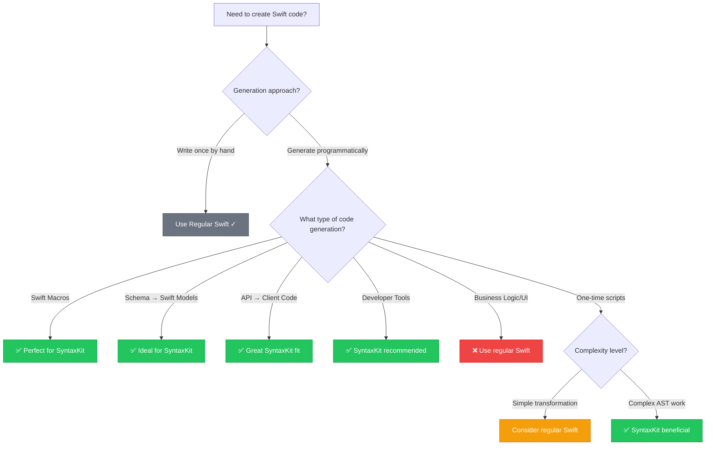

# When to Use SyntaxKit

Learn the key decision criteria for choosing SyntaxKit vs manual Swift code, with practical examples and decision frameworks.

## Overview

This tutorial guides you through the essential decision-making process for when SyntaxKit provides value over manual Swift development. You'll learn to identify scenarios where programmatic code generation excels, understand performance trade-offs, and avoid common anti-patterns.

**Time to complete:** 10-15 minutes

## Prerequisites

- Basic understanding of Swift development
- Familiarity with code generation concepts
- Optional: Experience with SwiftSyntax or Swift macros

## Step 1: The Core Decision Framework

The fundamental question when considering SyntaxKit is simple: **Are you generating Swift code programmatically, or writing it once by hand?**

### Decision Flowchart



### Key Decision Questions

Ask yourself these questions to determine if SyntaxKit is the right choice:

1. **Frequency**: Will this code be generated multiple times or from external inputs?
2. **Dynamism**: Does the code structure depend on external data (schemas, configurations, APIs)?
3. **Complexity**: Does the generation involve complex Swift syntax structures?
4. **Maintenance**: Will the generated code patterns change frequently?
5. **Team Impact**: Do multiple developers need to understand/modify the generation logic?

**If you answered "yes" to 2+ questions:** SyntaxKit is likely beneficial.
**If you answered "no" to most questions:** Regular Swift is probably better.

## Step 2: Scenario-Based Decision Matrix

Use this matrix to quickly categorize your use case:

| Scenario | SyntaxKit ✅ | Regular Swift ❌ | Key Factors |
|----------|-------------|------------------|-------------|
| **Swift Macros** | Always | Never | Complex AST manipulation made simple |
| **API Client Generation** | Yes | Rarely | Transform schemas into hundreds of endpoints |
| **Data Model Generation** | Yes | No | Schema-driven model creation with computed properties |
| **Migration Utilities** | Yes | No | Transform legacy code structures systematically |
| **Developer Tools** | Yes | Maybe | Create reusable code generators |
| **Build Scripts** | Maybe | Yes | Simple scripts don't need generation complexity |
| **Application Features** | No | Always | Business logic, views, standard app code |
| **One-time Prototypes** | No | Yes | Simple, write-once code doesn't justify overhead |
| **Performance-Critical** | No | Yes | Avoid compilation overhead where milliseconds matter |

## Step 3: Real-World Examples

### ✅ Perfect SyntaxKit Use Cases

#### API Client Generation
**Problem**: Manually writing 50+ API endpoints with consistent patterns.

```swift
// Manual approach: Error-prone, repetitive
struct UsersAPI {
    func getUser(id: Int) async throws -> User { /* networking boilerplate */ }
    func createUser(_ user: CreateUserRequest) async throws -> User { /* more boilerplate */ }
    func updateUser(id: Int, _ user: UpdateUserRequest) async throws -> User { /* repetitive */ }
    // ... 47 more similar endpoints
}
```

**SyntaxKit solution**: Generate from OpenAPI schema.

```swift
// Schema-driven generation
let apiClient = generateAPIClient(from: apiSchema) {
    for endpoint in spec.endpoints {
        Function(endpoint.name) {
            for param in endpoint.parameters {
                Parameter(param.name, type: param.type)
            }
        }
        .async()
        .throws()
        .returns(endpoint.responseType)
        .body {
            // Generated networking implementation
        }
    }
}
```

**Benefits**: 95% less code, type-safe, stays synchronized with API changes.

#### Swift Macro Development
**Problem**: Creating extension macros with complex member generation.

```swift
// Traditional SwiftSyntax: 100+ lines of AST manipulation
struct MembersMacro: MemberMacro {
    static func expansion(...) throws -> [DeclSyntax] {
        // Complex AST node construction
        let initParams = ParameterClauseSyntax(...)
        let initBody = CodeBlockItemListSyntax(...)
        // ... 80+ more lines of manual AST building
    }
}
```

**SyntaxKit solution**: Declarative member generation.

```swift
// SyntaxKit: Clean and readable
struct MembersMacro: MemberMacro {
    static func expansion(...) throws -> [DeclSyntax] {
        let members = Group {
            Function("init") {
                for property in extractedProperties {
                    Parameter(property.name, type: property.type)
                }
            }
            .body {
                for property in extractedProperties {
                    Assignment("self.\(property.name)", property.name)
                }
            }
        }
        return members.memberDeclListSyntax.map(\.declSyntax)
    }
}
```

**Benefits**: 60% less code, easier debugging, maintainable macro logic.

### ❌ Poor SyntaxKit Use Cases

#### Application Business Logic
**Problem**: Using SyntaxKit for standard app features.

```swift
// ❌ Overkill: Using SyntaxKit for simple view controller
let loginViewController = Class("LoginViewController") {
    Function("viewDidLoad") {
        Call("super.viewDidLoad")
        Call("setupUI")
    }
    
    Function("handleLogin") {
        // Generated login logic...
    }
}.inherits("UIViewController")
```

**Better approach**: Write directly in Swift.

```swift
// ✅ Appropriate: Standard iOS development
class LoginViewController: UIViewController {
    override func viewDidLoad() {
        super.viewDidLoad()
        setupUI()
    }
    
    func handleLogin() {
        // Standard login logic
    }
}
```

**Why**: No dynamic generation needed, standard iOS patterns, written once.

#### Simple One-Time Scripts
**Problem**: Using SyntaxKit for basic utilities.

```swift
// ❌ Unnecessary complexity
let converter = Function("convertToUppercase") {
    Parameter("input", type: "String")
}
.returns("String")
.body {
    Return {
        VariableExp("input.uppercased()")
    }
}
```

**Better approach**: Direct Swift implementation.

```swift
// ✅ Simple and clear
func convertToUppercase(_ input: String) -> String {
    return input.uppercased()
}
```

**Why**: Simple transformation, no schema dependency, written once.

## Step 4: Performance Considerations

### Compilation Impact

| Aspect | Regular Swift | SyntaxKit | Difference |
|--------|--------------|-----------|------------|
| **Build Time** | Baseline | +5-15% | One-time macro compilation cost |
| **Binary Size** | Smaller | +0% (runtime) | SyntaxKit not included in final app |
| **Development** | Faster iteration | Slightly slower | SwiftSyntax compilation overhead |

### Runtime Performance

**Critical insight**: Generated code performs identically to hand-written code.

```swift
// These compile to identical machine code:

// SyntaxKit-generated
struct User: Equatable {
    let id: UUID
    let name: String
}

// Hand-written
struct User: Equatable {
    let id: UUID
    let name: String
}
```

### When Performance Matters

**Choose SyntaxKit despite overhead when:**
- Developer time saved exceeds build time cost
- Code correctness is critical (complex AST manipulation)
- Maintenance burden of manual code is high

**Choose regular Swift when:**
- Extremely tight build time requirements
- Simple, static code that changes rarely
- Team unfamiliar with result builder patterns

## Step 5: Team Collaboration Factors

### SyntaxKit Advantages
- **Readability**: Declarative syntax is easier to review
- **Maintainability**: Less error-prone than AST manipulation
- **Consistency**: Generated code follows uniform patterns
- **Documentation**: Self-documenting generation logic

### Potential Challenges
- **Learning Curve**: Team needs result builder familiarity
- **Debugging**: Generated code debugging requires understanding generation
- **Dependencies**: Additional package dependency to manage

### Team Readiness Assessment

**Green Light Indicators:**
- Team comfortable with Swift result builders
- Complex code generation requirements
- Value consistency over individual flexibility
- Willing to invest in learning modern Swift patterns

**Yellow Light Indicators:**
- Mixed Swift experience levels
- Simple generation requirements
- Tight project deadlines
- Preference for minimal dependencies

## Step 6: Migration Strategy

### From Manual Code to SyntaxKit

**Phase 1: Identify Candidates**
```swift
// Look for repetitive patterns
struct UserAPI { /* 20 similar methods */ }
struct ProductAPI { /* 25 similar methods */ }
struct OrderAPI { /* 30 similar methods */ }
```

**Phase 2: Extract Common Patterns**
```swift
// Identify the template
func apiMethod(name: String, type: String) -> Function {
    Function(name) {
        Parameter("request", type: "\(type)Request")
    }
    .async()
    .throws()
    .returns(type)
}
```

**Phase 3: Implement SyntaxKit Generator**
```swift
// Generate all variants
let apiMethods = Group {
    for endpoint in apiEndpoints {
        apiMethod(name: endpoint.name, type: endpoint.type)
    }
}
```

### From Raw SwiftSyntax to SyntaxKit

**Before**: Complex AST manipulation
```swift
// 50+ lines of manual node construction
let structDecl = StructDeclSyntax(
    structKeyword: .keyword(.struct),
    name: .identifier("User"),
    memberBlock: MemberBlockSyntax(...)
)
```

**After**: Declarative construction
```swift
// Clean and readable
let userStruct = Struct("User") {
    Property("id", type: "UUID")
    Property("name", type: "String")
}
```

## Step 7: Common Anti-Patterns to Avoid

### Anti-Pattern 1: Over-Engineering Simple Cases
```swift
// ❌ Don't use SyntaxKit for this
let simpleProperty = Property("name", type: "String")

// ✅ Just write it directly
let name: String
```

### Anti-Pattern 2: Generating App Logic
```swift
// ❌ Don't generate view controllers
let viewController = Class("HomeViewController") {
    Function("viewDidLoad") { /* app logic */ }
}

// ✅ Write standard iOS code
class HomeViewController: UIViewController {
    override func viewDidLoad() { /* app logic */ }
}
```

### Anti-Pattern 3: Using SyntaxKit for Static Code
```swift
// ❌ No dynamic generation needed
let staticStruct = Struct("Config") {
    Variable(.let, name: "apiURL", equals: "\"https://api.example.com\"")
}

// ✅ Static configuration
struct Config {
    let apiURL = "https://api.example.com"
}
```

### Anti-Pattern 4: Premature Optimization
```swift
// ❌ Don't start with SyntaxKit "just in case"
let futureProofStruct = generateStruct(from: hardcodedData)

// ✅ Start simple, migrate when needed
struct SimpleModel {
    let data: String
}
```

## Step 8: Success Indicators

### You're Using SyntaxKit Successfully When:

- **Code Review Comments Decrease**: Less "this pattern is repeated everywhere"
- **Bug Reports Drop**: Fewer copy-paste errors in generated structures
- **Feature Velocity Increases**: New API endpoints/models added in minutes
- **Refactoring Becomes Trivial**: Schema changes propagate automatically
- **Team Confidence Grows**: Complex generation becomes approachable

### Red Flags Indicating Misuse:

- **Fighting the DSL**: Constantly working around SyntaxKit limitations
- **Debugging Nightmares**: More time debugging generation than implementation
- **Team Resistance**: Developers avoiding generation code
- **Performance Problems**: Build times significantly impacted
- **Over-Complexity**: Simple tasks take longer than manual approach

## Summary

**SyntaxKit excels when you're transforming external data into Swift code structures.** Perfect for macros, API clients, model generators, and developer tools. Use regular Swift for application logic, one-time scripts, and static code structures.

**The key insight**: Choose based on whether you're *generating* code or *writing* code. SyntaxKit transforms generation from error-prone AST manipulation into maintainable, declarative logic.

### Quick Reference

```swift
// ✅ Good SyntaxKit use: Dynamic generation
let models = generateModels(from: databaseSchema) {
    for table in schema.tables {
        Struct(table.name) {
            for column in table.columns {
                Property(column.name, type: column.swiftType)
            }
        }
    }
}

// ❌ Poor SyntaxKit use: Static application code
class AppDelegate: UIApplicationDelegate {
    func application(_ application: UIApplication, 
                    didFinishLaunchingWithOptions options: [UIApplication.LaunchOptionsKey: Any]?) -> Bool {
        return true
    }
}
```

## Next Steps

Ready to apply these concepts? Continue with:

- <doc:Creating-Macros-with-SyntaxKit> - Build your first macro
- [Quick Start Guide](https://swiftpackageindex.com/brightdigit/SyntaxKit/documentation) - 5-minute hands-on experience
- [Best Practices Article](https://swiftpackageindex.com/brightdigit/SyntaxKit/documentation) - Advanced patterns and optimization

## See Also

- ``Struct``
- ``Enum``
- ``Function``
- ``Class``
- ``Extension``